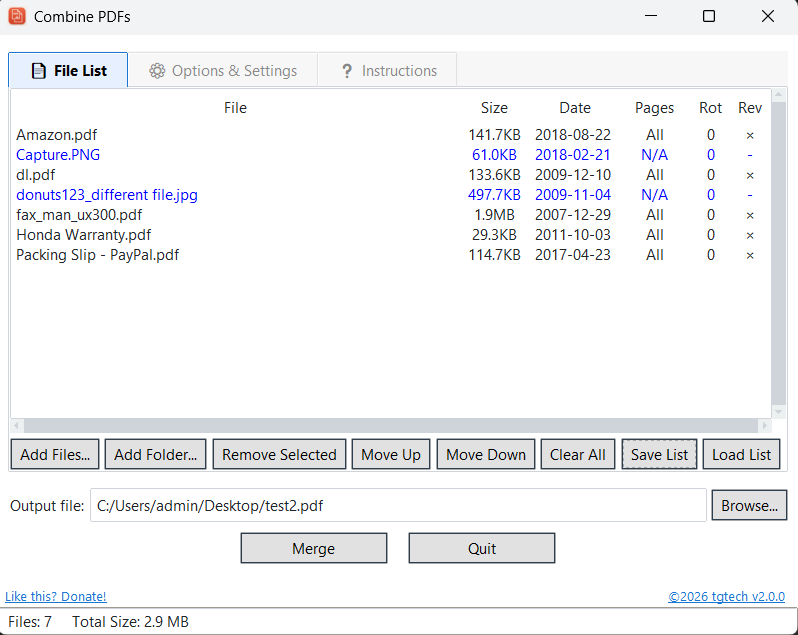
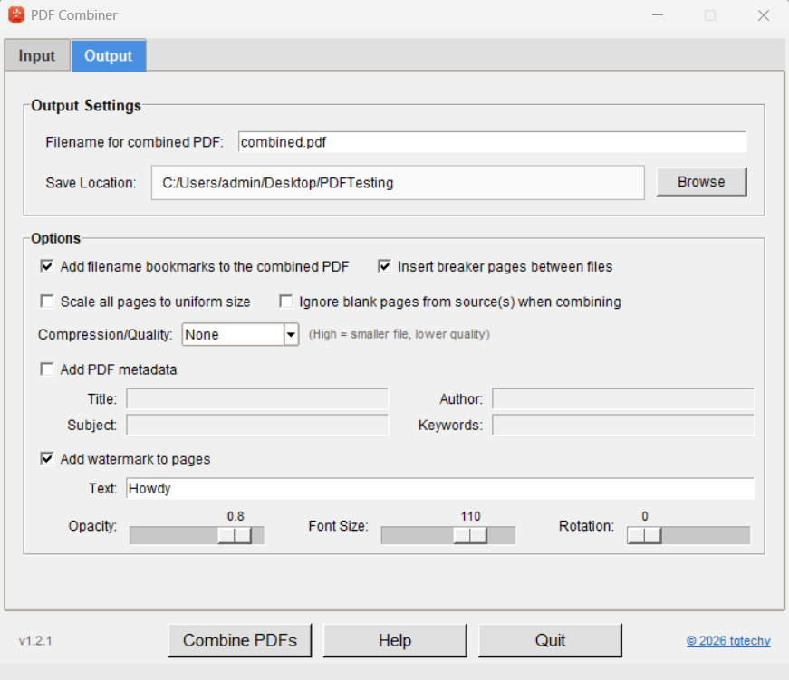

# PDFCombiner - Merge Several PDF Documents into a Single PDF Document

A free Windows 10/11 program to combine two or more PDF files into one PDF with lots of options, including page extraction, rotation, bookmarks and more.

<p align="left">
  
</p>
<p align="left">
  
</p>

# Windows Installation
Simply click the 'Releases' link on the right side of the page and select the CombinePDFs.exe file to download it.
You may get warnings since it is not digitally signed. You can compare the SHA hash of the exe to the one shown to ensure the exe has not been tampered with.

To bypass the Windows warning if it appears setup, click 'More info', then 'Run anyway' as shown below (pics are from Win11, Win10 may be a little different):


If you want to make a donation to support further development, [Donate via PayPal](https://www.paypal.me/tgtechdevshop)

# Help
ADDING FILES
• Click "Add PDFs to Combine..." to select PDF files to combine
• Select one or multiple files from your computer using the file browser
• Only PDF files can be added; other file types will be rejected
• The same file cannot be added twice

ORGANIZING FILES
• Drag files up or down to change the order they'll be combined
• Click a file to select it, Ctrl+Click on other files to select
  more than one file
• Hover over a file row to see the full path in the status bar at
  the bottom of the screen

SORTING
• Click column headers (Filename, File Size, Date) to sort
• Click again to reverse the sort order (arrows show sort direction)
• An up arrow (▲) means ascending, down arrow (▼) means descending

FILE PROPERTIES
• Page rotation: Set 0°, 90°, 180°, or 270° (clockwise) for each file
• Pages: Specify which pages to include in the combined PDF using:
  - "All" or leave empty for all pages
  - Single page: "5" (without the quotes)
  - Range: "1-10"    (without the quotes)
  - Multiple ranges: "1-3,5,7-9" (without the quotes)
• Rev: Check to reverse the page order for that file

OUTPUT SETTINGS
• Enter the desired filename for the combined PDF
• Click "Browse" to choose where to save the combined PDF
• Check "Add filename bookmarks" to create PDF bookmarks
  from each source file's name in the combined PDF
  - Existing bookmarks in files will be preserved under the filename
• Check "Insert breaker pages" to add a separator page before each
  file showing which file follows
• Check "Scale all pages to uniform size" to make all pages the same
  size (may produce unpredictable results with varying page sizes)
• Check "Ignore blank pages" to skip blank pages when combining
• Select Compression/Quality level to reduce file size (higher
  compression = smaller file but lower quality)

METADATA & WATERMARK
• Check "Add PDF metadata" to include Title, Author, Subject,
  and Keywords in the combined PDF
• Check "Add watermark to pages" to overlay text on all pages
  - Set text, opacity, font size, and rotation angle

COMBINING PDFs
• At least 2 files are required to combine
• Click "Combine PDFs" to merge the files
• Review the summary and click "Proceed"
• The combined PDF will be created at your chosen location

PREVIEW
• Hover over a file to see a thumbnail of its first page
• Uncheck "Preview first page on hover" to disable previews

STATUS BAR
• The bottom status bar shows the full path of the file
  you're currently hovering over or have selected

PRACTICAL LIMITS & PERFORMANCE
Memory Considerations:
• Each PDF is loaded entirely into memory, so RAM can be a bottleneck
• Try to keep individual PDF sizes under 1 GB for reliable performance

Number of PDFs to Combine:
• There is no hard-coded limit, but more than 100 files can be combined depending on their sizes
• The app processes files sequentially, so it's mainly constrained by:
  - Total available RAM (all pages accumulate in a PdfWriter object before writing to disk)
  - Combined size of all source PDFs

Combined Output Size:
• Can theoretically be as large as your disk space and available RAM
• However, if you're generating a combined PDF with 1000+ pages and/or multiple large files, you may experience:
  - Slow progress bar updates
  - Memory strain during the compression phase (if compression is enabled)
  - Extended write times

Real-World Guidelines:
• Source PDFs: Keep each file well under 1 GB for smooth operation
• Number of files: 2-50 files to combine is very reliable; 50-100+ will slow down based on sizes
• RAM recommendation: 4 GB minimum; 8 GB+ for larger operations

Key Factors Affecting Performance:
• The PDF engine (PyPDF2) efficiency handles several GB sized files but slows with size
• Compression consumes RAM and processing time
• Page scaling/transformations add memory overhead per page
• Available system RAM limits the aggregate size you can process

If you would like to build the exe from scratch rather than download the .exe file in the releases section ...

## Build Instructions

This project is a Python/Tkinter app to combine PDF files with drag-and-drop reordering and many other options.

### Build a Windows executable using PyInstaller

**Prerequisites**
- Python 3.8+ installed and on PATH
- Recommended: create and activate a virtual environment

**Quick build (from project root):**

1) Install dependencies (in venv):

```powershell
python -m pip install -r requirements.txt
```

2) Build using the helper script (Windows):

```powershell
.\build_exe.bat
```

**What the script does**
- Installs/updates PyInstaller
- Includes `pdfcombinericon.png` and `pdfcombinericon.ico`
- Runs PyInstaller to create `dist\CombinePDFs.exe` (single-file, windowed)

**Manual PyInstaller command**

If you prefer to run PyInstaller manually, use:

```powershell
pyinstaller --noconfirm CombinePDFs.spec
```

**Notes**
- The generated exe will be in the `dist` folder.
