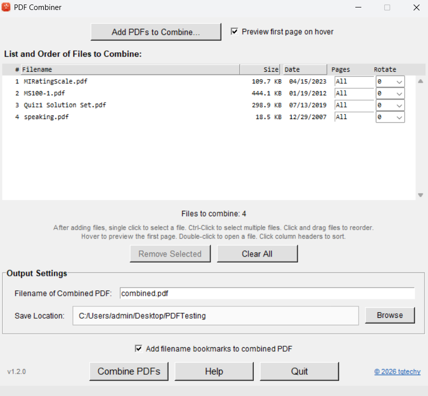

# Combine PDFs

A program to combine two or more PDF files into one PDF with lots of options, including page selection, rotation, adding bookmarks and more.

<p align="center">
  
</p>

# Windows Installation
Simply click the 'Releases' link and select the CombinePDFs.exe file to download it.
You may get warnings since it is not digitally signed. You can compare the SHA hash of the exe to the one shown to ensure the exe has not been tampered with.

If you would like to build the exe from scratch ...

## Build Instructions

This project is a Python/Tkinter app to combine PDF files with drag-and-drop reordering and many other options.

### Build a Windows executable using PyInstaller

**Prerequisites**
- Python 3.8+ installed and on PATH
- Recommended: create and activate a virtual environment

**Quick build (from project root):**

1) Install dependencies (in venv):

```powershell
python -m pip install -r requirements.txt
```

2) Build using the helper script (Windows):

```powershell
.\build_exe.bat
```

**What the script does**
- Installs/updates PyInstaller
- Includes `pdfcombinericon.png` and `pdfcombinericon.ico`
- Runs PyInstaller to create `dist\CombinePDFs.exe` (single-file, windowed)

**Manual PyInstaller command**

If you prefer to run PyInstaller manually, use:

```powershell
pyinstaller --noconfirm CombinePDFs.spec
```

**Notes**
- The generated exe will be in the `dist` folder.
