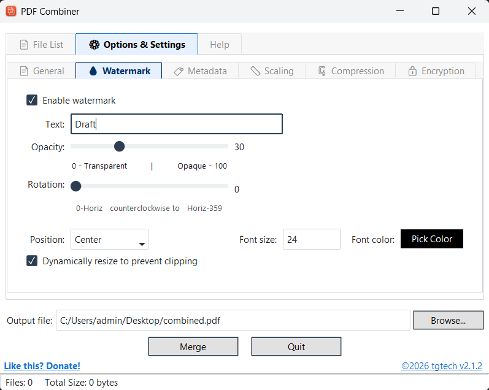

<h1 align="center">PDF Combiner</h1>

Merge multiple PDF documents and images into a single file

  
  
  
  
  

---
- [Overview](#overview)
- [Screenshots](#screenshots)
- [Windows Installation](#windows-installation)
  - [Installer Verification (SHA‑256)](#installer-verification-sha-256)
  - [Windows SmartScreen Warning](#windows-smartscreen-warning)
- [Antivirus False Positives](#antivirus-false-positives)
- [Donations](#donations)
- [Build Instructions](#build-instructions)
  - [Build a Windows Executable Using PyInstaller](#build-a-windows-executable-using-pyinstaller)
- [FAQ](#faq)
- [Disclaimer](#disclaimer)

---

## Overview
PDF Combiner is a free, standalone Windows 10/11 application for merging two or more PDF files and/or images into a single PDF document. It offers powerful features such as selective page extraction, rotation, bookmarks, encryption, and more. No data is ever uploaded or downloaded — all processing happens entirely on your device to protect your privacy.

The app was created out of frustration with the lack of simple, free, ad‑free, privacy‑focused PDF combining tools.

---

## Screenshots

<table>
<tr>
<td align="center"> <em>Startup Screen</em></td>
<td align="center"> <em>Input Files Tab</em></td>
</tr>
<tr>
<td align="center"> <em>General Options Tab</em></td>
<td align="center"> <em>Watermark Options Tab</em></td>
<td></td>
</tr>
</table>

---

## Windows Installation
1. Click **Releases** on the right side of this page.  
2. Download the latest `PDFCombinerInstaller_X.Y.Z.exe`.  
3. Double‑click the installer to begin installation.

### Installer Verification (SHA‑256)
Each release includes a SHA‑256 hash.  
To verify the installer:

**PowerShell:**
\`\`\`powershell
Get-FileHash PDFCombinerInstaller_X.Y.Z.exe -Algorithm SHA256
\`\`\`

Compare the output to the hash listed in the release notes.  
If they match, the installer is authentic and untampered.

### Windows SmartScreen Warning
Because the installer is not digitally signed, Windows may show a SmartScreen warning.

Click:
1. **More info**  
2. **Run anyway**

Screenshots:

---

## Antivirus False Positives
The installer is built with Inno Setup, which can occasionally trigger antivirus warnings due to heuristic detection. This does **not** indicate malicious behavior.

Reasons false positives occur:
- Heuristic scanners sometimes flag compressed installer stubs  
- New executables with low reputation may be flagged automatically  
- No network activity or external payloads are included  

The installer is built directly from the published source code.

---

## Donations
If this tool saves you time or helps your workflow, consider supporting development:

### 👉 [Donate via PayPal](https://www.paypal.me/tgtechdevshop)

Your support helps keep the project free, ad‑free, and privacy‑focused.

---

## Build Instructions
If you prefer to build the executable yourself rather than using the pre‑compiled installer:

This project is a Python/Tkinter application for combining PDF files.

### Build a Windows Executable Using PyInstaller

**Prerequisites**
- Python 3.8+ installed and on PATH  
- Recommended: create and activate a virtual environment  

**Install dependencies:**
\`\`\`powershell
python -m pip install -r requirements.txt
\`\`\`

**Build using PyInstaller:**
\`\`\`powershell
pyinstaller --noconfirm CombinePDFs.spec
\`\`\`

The generated `.exe` will appear in the `dist` folder.

---

## FAQ

### **Does the app upload my PDFs anywhere?**
No. All processing happens locally on your device. No files ever leave your computer.

### **Why does Windows warn me when I run the installer?**
The installer is unsigned. Unsigned apps trigger SmartScreen warnings by default.

### **Why do some antivirus tools flag the installer?**
Heuristic scanners sometimes misidentify compressed installers. These are false positives.

### **Can I run this on macOS or Linux?**
Not currently. The app is designed for Windows 10/11.

### **Can I build it myself?**
Yes — full build instructions are included above.

---

## Disclaimer
Use at your own risk. Although thoroughly tested, software can cause unexpected outcomes. tgtechy is not responsible for data loss or corruption.