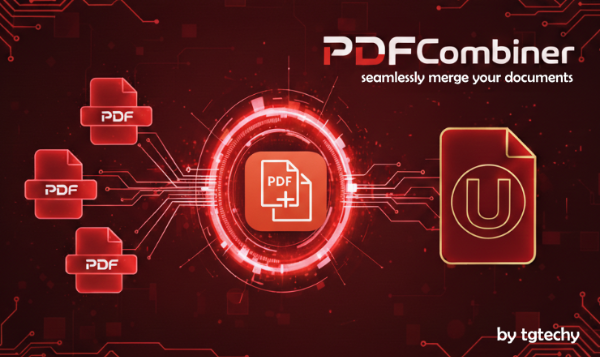
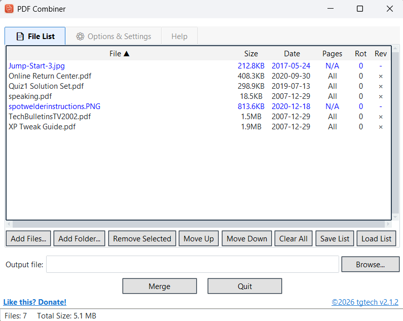
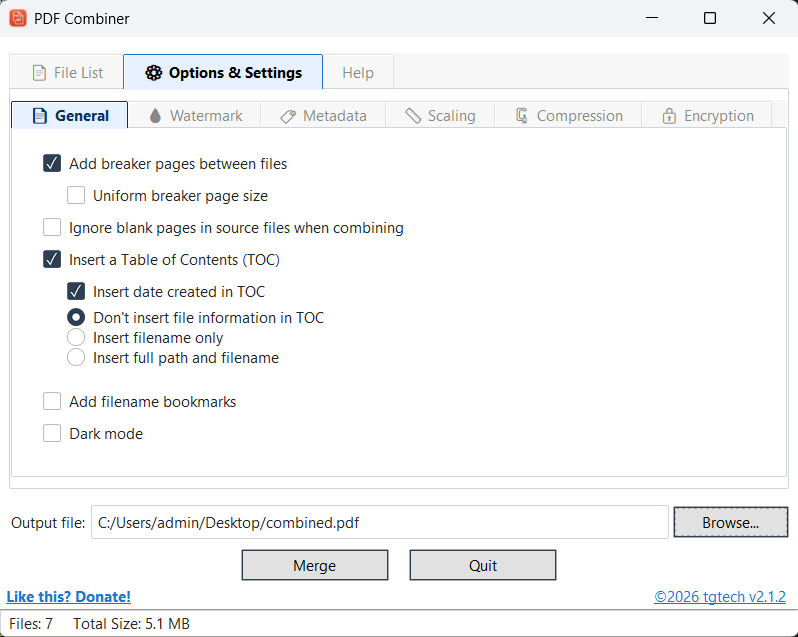

<!-- markdownlint-configure-file {
  "MD033": false,
  "MD041": false
} -->
<div align="center">
# PDF Combiner
Merge multiple PDF documents and images into a single file
</div>

PDF Combiner is a free, standalone Windows 10/11 application for merging two or more PDF files and/or images into a single PDF document. It offers powerful features such as selective page extraction, rotation, bookmarks, encryption, and more. No data is ever uploaded or downloaded — all processing happens entirely on your device to protect your privacy. The app was created out of frustration with the lack of simple, free, ad‑free, privacy‑focused PDF combining tools.

<p align="left">
  
</p>

<p align="left">
  
</p>
<p align="left">
  
</p>

# Windows Installation and Use
Click the 'Releases' link on this page then click the PDFCombinerInstaller_X.Y.Z.exe file to download it. Double click the installer to install the app.
You may get warnings since it is not digitally signed. You can compare the SHA hash of the exe to the one shown in the release notes to ensure the exe has not been tampered with.

To bypass the Windows warning if it appears when trying to install/run, click 'More info', then 'Run anyway' as shown below (pics are from Win11, Win10 may be a little different):


⚠️ About Antivirus False Positives: The installer is built with Inno Setup and it can occasionally trigger antivirus warnings even when the software is completely safe. This happens because many scanners use heuristic detection, and compressed installer stubs sometimes resemble patterns used by generic malware. New or low‑reputation executables may also be flagged simply because they haven’t been widely downloaded yet. These alerts are false positives — the installer is built directly from the published source code and contains no network activity or external payloads.

If you want to make a donation to support further development, [Donate via PayPal](https://www.paypal.me/tgtechdevshop)

If you would like to build the .exe from scratch rather than download the .exe file in the releases section ...

## Build Instructions (if you don't want to use the provided pre-compiled .exe)

This project is a Python/Tkinter app to combine PDF files.

### Build a Windows executable using PyInstaller

**Prerequisites**
- Python 3.8+ installed and on PATH
- Recommended: create and activate a virtual environment

**Quick build (from project root):**

1) Install dependencies (in venv):

```powershell
python -m pip install -r requirements.txt
```
2) Run PyInstaller:

```powershell
pyinstaller --noconfirm CombinePDFs.spec
```

**Notes**
- The generated .exe will be in the `dist` folder.

## Disclaimer

Use at your own risk. Although thoroughly tested, software can cause unexpected outcomes. tgtechy is not responsible for data loss or corruption.